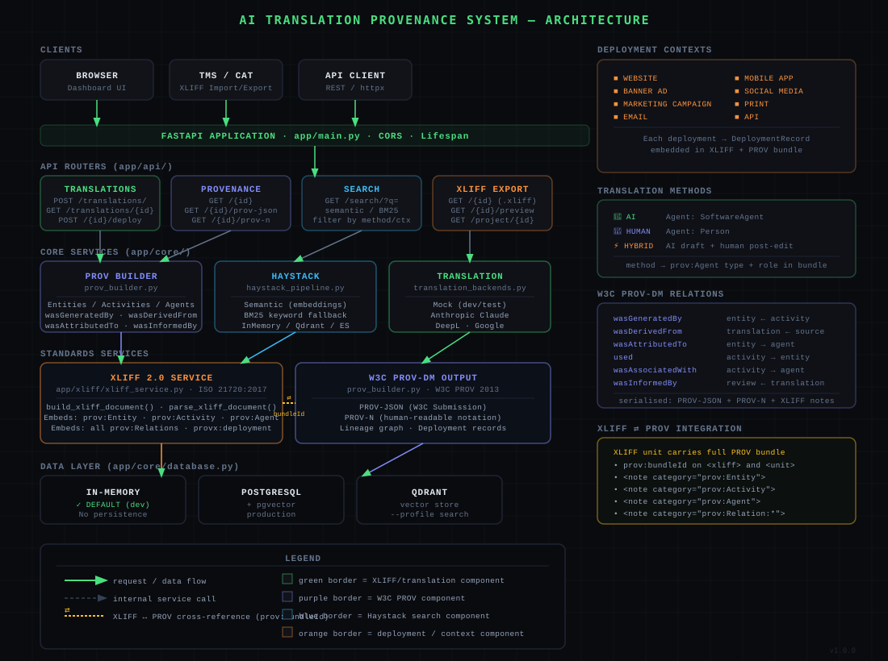

# AI Translation Provenance System

> End-to-end provenance tracking for AI-translated content — built with **FastAPI**, **Haystack**, **XLIFF 2.0**, and **W3C PROV-DM**.

[](https://www.python.org/)
[](https://fastapi.tiangolo.com/)
[](https://docs.oasis-open.org/xliff/xliff-core/v2.0/)
[](https://www.w3.org/TR/prov-dm/)
[](LICENSE)

---

## What It Does

This system answers the key provenance questions for every piece of translated content in your organisation:

| Question | Where it lives |
|----------|---------------|
| **What** was translated? | `SourceText` entity — source text, language, domain |
| **By whom / what?** | `prov:Agent` — AI model + version, or named human translator |
| **How?** | `TranslationMethod` — AI, Human, or Hybrid (AI + human post-edit) |
| **When?** | Activity timestamps — translated_at, reviewed_at, deployed_at |
| **Where is it used?** | `DeploymentRecord` — Website, Banner Ad, Marketing Campaign, Email, Mobile App, Social Media, Print, API, CMS |
| **What standard proves it?** | XLIFF 2.0 file or JSON document, either one carrying the full embedded W3C PROV bundle, + PROV-JSON / PROV-N exports |

Beyond tracking provenance, the system runs a **threshold-quality redrive
loop**: score every translation (deterministic checks, falling back to a
pluggable model scorer), automatically resend anything below a threshold for
retranslation, and record the whole thing — new version, new provenance,
`wasRevisionOf` link back to what it replaced — with an optional
human-in-the-loop gate before any redrive actually goes live. Reviewing that
content happens in-context: the **Review Shell** overlays the real rendered
page with clickable highlight boxes instead of a segment-grid TMS view (see
[Run the review environment](#run-the-review-environment-review-shell)
below).

On top of that: **brand voice/tone/terminology adherence** is tracked as its
own scoring axis alongside translation quality, grounded by a **pgGraph**
retrieval layer (style guides, glossary terms, and prior-translation
exemplars, hybrid vector+graph) that feeds context into AI translation
*before* it happens rather than only scoring after the fact; **MQM/COMET/
METEOR** formalize what "quality" means (a real 44-error-type taxonomy, a
trained reference-free QE regression model, and a lexical regression check)
instead of one ad-hoc number; and **every translate/evaluate/retranslate
step is multi-provider** — OpenAI, Anthropic Claude, Google Gemini, Google
Translate, Microsoft Translator, Ollama (including Unbabel's Tower/Tower+),
LMStudio, and vLLM are all selectable per request, not just at process
startup, **and the specific model within a provider is read live** (`GET
/api/v1/models/{provider}`) rather than hardcoded — Ollama's locally pulled
models, LMStudio/vLLM's currently-loaded model, and whatever your Claude/
OpenAI/Gemini API key actually has access to.

The Review Shell is segmented into four workflows matching how the work
actually happens: **Content Creation** (define voice, import legacy content
— TMX, XLIFF, or now CSV — write/check/translate new copy), **Quality
Review** (in-context review, redrive, vendor scorecard, cross-document
consistency), **Audit** (third-party site i18n/compliance review, a
separate concern, optionally crawling as an authenticated user for
sites that gate content behind a login), and **Analytics** (system-wide
totals and charts, aggregating across the other three). Every translation
unit's full history — provenance, deployment record, lineage graph, XLIFF
export, automatic quality-metric scores, context screenshots — is reachable
directly from the Review tab's segment drawer, not just via the API. See
[`ROADMAP.md`](ROADMAP.md) for the full phase-by-phase build history and
[`docs/quality-evaluation-research.md`](docs/quality-evaluation-research.md)
/ [`docs/graphrag-provenance-proposal.md`](docs/graphrag-provenance-proposal.md)
for the research behind these decisions.

### Built for Transcreation, Not Just Literal Translation

A recurring use case: **marketing copy**, where the right move is often
**transcreation** — rewording a message to preserve intent, tone, and
cultural fit in the target market rather than translating it word-for-word
(a tagline, a pun, a culturally-specific reference rarely survives literal
translation intact). This system treats that as the normal case, not an
edge case to work around:

- **XLIFF itself doesn't require literal correspondence.** A `<unit>`'s job
  is to pair a source segment with whatever target text was ultimately
  produced — a straight AI translation, a human transcreation, or a hybrid
  post-edit are all just "the target text," carrying the same embedded PROV
  metadata either way (see [XLIFF ⇄ W3C PROV Integration](#xliff--w3c-prov-integration)
  below). Nothing in the format — or in this system's `TranslationMethod`
  field (`ai` | `human` | `hybrid`) — checks or expects the target to
  resemble the source.
- **Style guides ground the adaptation, not the wording.** A rule like
  "playful, never literal — adapt idioms for the local market" (see
  [Style Guides, Glossary & Voice Check](#style-guides-glossary--voice-check-pggraph-retrieval)
  below) is a real, retrieved instruction an AI translation follows and a
  reviewer's tone/voice score is judged against — brand intent, not
  string similarity to the source.
- **Quality scoring judges meaning and voice, not resemblance.** The
  MQM-style LLM judge behind redrive/evaluate (see
  [Quality & Evaluation](#quality--evaluation-mqm--comet--meteor) below)
  flags mistranslations, fluency issues, and register/style errors — it
  doesn't penalize a target for diverging from the source's literal wording.
  The automatic (non-LLM) metrics are a narrower tool by contrast: COMET-Kiwi
  and METEOR are similarity/adequacy-style signals better suited to QA on
  literal MT output, and are kept as an independent, informational axis for
  exactly this reason — never blended into the score that actually gates a
  redrive, and never the right signal to lean on for creative copy.

---

## Architecture



```
┌──────────────────────────────────────────────────────────────────┐
│  CLIENTS: Browser Dashboard · TMS/CAT (XLIFF) · API clients      │
└────────────────────────┬─────────────────────────────────────────┘
                         │ HTTP / REST
┌────────────────────────▼─────────────────────────────────────────┐
│  FASTAPI APPLICATION  (app/main.py)                               │
│  ┌─────────────┐ ┌────────────┐ ┌──────────┐ ┌───────────────┐  │
│  │Translations │ │ Provenance │ │  Search  │ │ XLIFF Export  │  │
│  │ /api/v1/    │ │ /api/v1/   │ │ /api/v1/ │ │  /api/v1/     │  │
│  └──────┬──────┘ └─────┬──────┘ └────┬─────┘ └───────┬───────┘  │
└─────────┼──────────────┼─────────────┼───────────────┼──────────┘
          │              │             │               │
┌─────────▼──────────────▼─────────────▼───────────────▼──────────┐
│  CORE SERVICES                                                    │
│  ┌─────────────────┐  ┌──────────────────┐  ┌─────────────────┐ │
│  │  PROV Builder   │  │ Haystack Pipeline│  │   Translation   │ │
│  │ (W3C PROV-DM)   │  │ Semantic + BM25  │  │    Backends     │ │
│  └────────┬────────┘  └────────┬─────────┘  └────────┬────────┘ │
└───────────┼────────────────────┼─────────────────────┼──────────┘
            │  ⇄ bundleId        │                      │
┌───────────▼────────────────────┼──────────────────────▼──────────┐
│  STANDARDS LAYER                                                  │
│  ┌──────────────────────────┐  │  ┌──────────────────────────┐   │
│  │    XLIFF 2.0 Service     │  │  │   W3C PROV-DM Output     │   │
│  │  ISO 21720:2017          │  │  │   PROV-JSON · PROV-N     │   │
│  │  Embeds full PROV bundle │◄─┘  │   Lineage graph          │   │
│  │  per <unit>              │     └──────────────────────────┘   │
│  └──────────────────────────┘                                     │
└──────────────────────────────────────────────────────────────────┘
```

### XLIFF ⇄ W3C PROV Integration

This is the core design decision: **every XLIFF `<unit>` is a self-contained provenance artifact**.

```xml
<unit id="abc123" prov:bundleId="bundle:abc123">
  <notes>
    <!-- Core metadata -->
    <note category="provx:translationMethod">ai</note>
    <note category="dc:date">2025-06-01T10:30:00Z</note>

    <!-- W3C PROV Entities -->
    <note category="prov:Entity" id="entity:source:...">
      entityType=SourceText; language=en-US; ...
    </note>
    <note category="prov:Entity" id="entity:translation:...">
      entityType=Translation; targetLanguage=fr-FR; ...
    </note>

    <!-- W3C PROV Activities -->
    <note category="prov:Activity" id="activity:translate:...">
      activityType=Translation; startedAt=...; agentId=...
    </note>

    <!-- W3C PROV Agents -->
    <note category="prov:Agent" id="agent:...">
      name=claude-sonnet-4; agentType=SoftwareAgent; organization=Anthropic
    </note>

    <!-- W3C PROV Relations -->
    <note category="prov:Relation:wasGeneratedBy" id="prov:rel:0:wasGeneratedBy">
      entity=entity:translation:...; activity=activity:translate:...
    </note>
    <note category="prov:Relation:wasAttributedTo" id="prov:rel:1:wasAttributedTo">
      entity=entity:translation:...; agent=agent:...
    </note>

    <!-- Deployment -->
    <note category="provx:deployment" id="dep:...">
      context=banner_ad; location=https://ads.example.com/fr; active=True
    </note>

    <!-- Bundle cross-reference -->
    <note category="prov:Bundle" id="prov:bundleId">bundle:abc123</note>
  </notes>
  <segment state="translated">
    <source dc:language="en-US">Welcome to our platform.</source>
    <target dc:language="fr-FR">Bienvenue sur notre plateforme.</target>
  </segment>
</unit>
```

---

## Quick Start

### Prerequisites

- Python 3.11+
- `pip` or a virtual environment manager
- PostgreSQL, reachable (or Docker, to run it via `docker-compose up postgres`) — the system of record, not optional
- Node.js 18+ / npm — only needed for the Review Shell (`frontend/`) and its demo fixture, not the API server itself
- A Playwright-managed Chromium install — only needed for Phase 8's "review any URL" fetch mode (`playwright install chromium`, see below)

### Installation

```bash
git clone https://github.com/pcc01/content-provenance.git
cd content-provenance

# Create and activate virtual environment
python -m venv .venv
source .venv/bin/activate          # Windows: .venv\Scripts\activate

# Install dependencies
pip install -r requirements.txt

# One-time: install the headless browser Phase 8's fetch+rewrite mode uses
# to render arbitrary URLs (skip this if you'll only use the cooperative
# SDK-tagging model, or Documents/text-Markdown review)
playwright install chromium

# Copy environment config
cp .env.example .env

# Start Postgres (or point .env at your own — see .env.example)
docker-compose up -d postgres

# Apply migrations
alembic upgrade head
```

### Run (development — mock translation)

```bash
uvicorn app.main:app --reload --port 8001
```

> Port 8001, not the default 8000 — chosen to avoid colliding with another
> project's stack that may already be using 8000/5432/6379/3000/9090 on the
> same machine. Use whatever port is free on yours; just keep it consistent
> with `frontend/vite.config.ts`'s proxy target and `frontend/demo-target`'s
> `VITE_API_BASE` if you change it.

Open http://localhost:8001/docs for the interactive API explorer. The review
UI now lives in `frontend/` (a Vite+React app, see its own dev instructions)
rather than being served as a static dashboard from this server.

### Run with Anthropic Claude translation

```bash
# Set your key in .env
ANTHROPIC_API_KEY=sk-ant-...
TRANSLATION_PROVIDER=anthropic

uvicorn app.main:app --reload --port 8001
```

> PostgreSQL is the system of record for everything (translations, provenance,
> XLIFF documents, quality scores, redrive runs, image assets). Re-run
> `alembic upgrade head` after pulling any change that touches
> `alembic/versions/`.

### Run with Docker

```bash
# App + PostgreSQL (mock translation) — host ports 8001 (app) / 5433 (postgres),
# deliberately offset from 8000/5432 in case another project's stack is
# already using those on the same machine
docker-compose up

# With persistent Qdrant vector store
docker-compose --profile search up

# Full stack (Qdrant + Elasticsearch too)
docker-compose --profile full up

# With a local Strapi instance for testing the CMS integration
docker-compose --profile cms up -d --build strapi
python scripts/bootstrap_strapi.py   # sets it up end-to-end — see CONTRIBUTING.md
```

### Run the review environment (Review Shell)

The review UI is a separate Vite+React app, not served as a static file from
the API server. In development, run it alongside the backend:

```bash
cd frontend && npm install && npm run dev       # Review Shell — http://localhost:5173
```

Once (or after changing `review-sdk/overlay.ts`), build the standalone SDK
bundle Phase 8's fetch+rewrite pages inject — `npm run dev`/`npm run build`
don't do this for you automatically:

```bash
cd frontend && npm run build:sdk                # frontend/review-sdk/dist/overlay.js
```

To exercise the in-context overlay end-to-end, also run the demo fixture it
iframes (a minimal page tagged with the review SDK — see
[`frontend/review-sdk/`](frontend/review-sdk)):

```bash
cd frontend/demo-target && npm install && npm run dev   # http://localhost:5174
```

Open the Review Shell, enter the demo target's URL (defaults to
`http://localhost:5174`), and click "Load page" — translated elements get
highlighted directly on the rendered page; click one to open the review
drawer (source/target, version history, provenance, notes).

Alternatively, switch the Review tab to **"Any URL"** mode and paste any
URL — no demo fixture, no SDK tagging, no app changes at all. This routes
through Phase 8's fetch+rewrite loader (`GET /api/v1/pages/render`), which
renders the page with a headless browser, harvests its text server-side,
and serves back a tagged copy the same overlay reviews identically. This is
the path to use against a real app you don't want to (or can't) modify.

Adopting the SDK in a real app instead of the demo fixture just means wrapping translated
strings with `data-tu-id` tag props — see `frontend/review-sdk/reviewTagProps.ts`
and `useReviewT.ts`.

For production, `npm run build` in `frontend/` produces `frontend/dist/`
(and, as part of the same script, `frontend/review-sdk/dist/overlay.js`),
which `app/main.py` serves directly — no separate frontend server needed.

### Review Shell Segments

Four top-level segments, each a stage of the actual workflow rather than an
arbitrary grouping:

| Segment | Pages | What it's for |
|---------|-------|----------------|
| **Content Creation** | Create, Style Guides, Import, Documents | Everything BEFORE a translation exists: define brand voice (Style Guides), bring in legacy vendor content (Import — TMX, XLIFF, and the Import page's ingest ledger), write/check/translate new copy (Create), or bulk-import a `.txt`/`.md`/`.csv` file (Documents) |
| **Quality Review** | Review, Live (extension), Redrive, Images, Vendor Scorecard, Consistency, Search | Everything about evaluating and improving translations already in the system — in-context review (SDK-tagged app, live browser tab, or any URL), threshold redrive with a worklist and ad-hoc evaluate/METEOR-compare tools, image localization, per-vendor scoring, cross-document term/tone consistency, semantic/keyword search |
| **Audit** | (single page) | A THIRD-PARTY site compliance tool — genuinely separate from this system's own translations; optionally authenticated (see [Authenticated Crawling/Fetching](#authenticated-crawlingfetching)) |
| **Analytics** | (single page) | System-wide totals and charts (by-method bar chart, by-status donut chart) aggregating across all three segments above |

Every page opens with a short intro stating what it's for and, where it
isn't obvious from the form alone, what input is required to start (or that
none is — several pages just load automatically). Every language field is a
dropdown (`LocaleSelect`) with the ten most-spoken languages pinned above a
broader list, not free text. Every provider dropdown that offers more than
one model (Ollama/LMStudio/vLLM/Claude/OpenAI/Gemini) reveals a second,
live-populated model dropdown — see [Model Discovery](#model-discovery).

---

## API Reference

### Translations

| Method | Endpoint | Description |
|--------|----------|-------------|
| `POST` | `/api/v1/translations/` | Submit content for translation — returns translation + provenance IDs |
| `GET`  | `/api/v1/translations/` | List all translation units (filter by language, method, status) |
| `GET`  | `/api/v1/translations/batch?ids=a,b,c` | Bulk lookup with latest quality score — what the review overlay uses to score a whole page in one call |
| `GET`  | `/api/v1/translations/{id}` | Get a specific translation unit |
| `GET`  | `/api/v1/translations/{id}/versions` | Full edit history (initial / human_edit / import / redrive / revert) |
| `POST` | `/api/v1/translations/{id}/versions/{version_id}/revert` | Phase 9: restore an earlier version's text as a new version (never rewrites history) |
| `POST` | `/api/v1/translations/{id}/deploy` | Record a new deployment location |
| `PUT`  | `/api/v1/translations/{id}/review` | Mark as human-reviewed |
| `GET`  | `/api/v1/translations/stats` | Aggregated statistics — powers the Review Shell's **Analytics** segment |
| `GET`/`POST` | `/api/v1/translations/{id}/notes` | Review notes thread (threaded via `parent_id`) |
| `PUT`  | `/api/v1/translations/{id}/notes/{note_id}/resolve` | Mark a note resolved/unresolved |

Deploy/mark-as-reviewed are both in the Review tab's segment drawer now, not
just the API — its "Details" tab has a "Record a deployment" form and a
"Mark as reviewed" button.

**POST /api/v1/translations/ — request body**

```json
{
  "source_text": "Welcome to our platform.",
  "source_language": "en-US",
  "target_language": "fr-FR",
  "method": "ai",
  "context": "banner_ad",
  "deployment_location": "https://ads.example.com/campaign/q4",
  "domain": "marketing",
  "translator_name": null,
  "provider": null,
  "model": null
}
```

`method`: `ai` | `human` | `hybrid`  
`context`: `website` | `banner_ad` | `marketing_campaign` | `email` | `mobile_app` | `social_media` | `print` | `api`  
`provider`/`model`: optional per-request overrides — see
[Translation & Evaluation Backends](#translation--evaluation-backends).

### Provenance

| Method | Endpoint | Description |
|--------|----------|-------------|
| `GET`  | `/api/v1/provenance/{id}` | Full W3C PROV record with entities, activities, agents, relations |
| `GET`  | `/api/v1/provenance/{id}/prov-json` | W3C PROV-JSON serialisation |
| `GET`  | `/api/v1/provenance/{id}/prov-n` | W3C PROV-N human-readable notation |
| `GET`  | `/api/v1/provenance/{id}/lineage` | Lineage graph (nodes + edges for visualisation) |
| `GET`  | `/api/v1/provenance/{id}/deployments` | All deployment records |

All five are surfaced in the Review tab's segment drawer ("Provenance"
tab) — agent/activity/entity/relation summary, a lineage node/edge count
with an expandable edge list, the deployment history, and direct
download links for XLIFF/PROV-JSON/PROV-N (plus an inline, lazy-loaded raw
XLIFF preview) — not just reachable via the API.

### Search (Haystack)

| Method | Endpoint | Description |
|--------|----------|-------------|
| `GET`  | `/api/v1/search/?q={query}` | Semantic or BM25 search over all translations — response also includes `indexed_documents`/`search_type`, shown in the Search tab |
| `GET`  | `/api/v1/search/indexed-count` | Number of documents in the vector store |

Query params: `semantic` (bool), `method`, `context`, `top_k`

### XLIFF Export & Import

Every XLIFF document entering (import) or leaving (export) the system is
logged in an ingest ledger — the literal "track everything entering and
leaving the system" record.

| Method | Endpoint | Description |
|--------|----------|-------------|
| `GET`  | `/api/v1/xliff/{id}` | Download XLIFF 2.0 file with embedded PROV metadata (incl. per-version history notes) — a direct link in the segment drawer's Provenance tab |
| `GET`  | `/api/v1/xliff/{id}/preview` | Preview XLIFF as text — an inline, lazy-loaded `<details>` in the same tab |
| `GET`  | `/api/v1/xliff/project/{id}` | Export full project as a single XLIFF document — API-only; no project-management UI exists yet to create/browse a `TranslationProject` to export |
| `POST` | `/api/v1/xliff/import` | Ingest an external XLIFF 2.0 document (multipart `file` + `source_system`) — creates/updates units and their version history; synthesizes minimal provenance if the file carries none |
| `GET`  | `/api/v1/xliff/ingest-log` | The entering/leaving ledger — the Import page's "Ingest ledger" table |

### JSON Export & Import

The JSON peer of XLIFF export/import above — same idea (translation text +
the complete embedded provenance chain, single-unit or whole-project), same
shared ingest ledger (`IngestEvent.format` distinguishes `"xliff"` from
`"json"`; both show up in either ledger endpoint), but JSON instead of XML,
and no note-based key=value packing — every field is just a real JSON key.
Distinct from `GET /provenance/{id}/prov-json` above, which only ever
serializes the bare PROV bundle (no source/target text, no deployments, no
version history, no import counterpart).

| Method | Endpoint | Description |
|--------|----------|-------------|
| `GET`  | `/api/v1/json/{id}` | Download a JSON provenance document (source/target text, full embedded provenance, deployments, version history) |
| `GET`  | `/api/v1/json/{id}/preview` | Preview the same document without triggering a download |
| `GET`  | `/api/v1/json/project/{id}` | Export a full project as a single JSON document |
| `POST` | `/api/v1/json/import` | Ingest a JSON document (multipart `file` + `source_system`) — creates/updates units and their version history. Lenient: accepts this system's own extensive export, a bare `{"units":[...]}` array, or a single bare unit object, with a few common field-name aliases (`sourceText`/`source`/`text`, etc.). Provenance is always rebuilt fresh server-side rather than trusted from the file, so importing a minimal file and exporting it back is how a plain JSON file becomes the fully provenance-enriched version |
| `GET`  | `/api/v1/json/ingest-log` | Same ledger as `/api/v1/xliff/ingest-log`, exposed under this prefix too for discoverability |

### Threshold-Quality Redrive

Score everything in scope, then redrive (retranslate) whatever falls below a
threshold — the core loop this system is built around, modeled on an offline
QE-scorer → threshold → MT-fallback-chain pipeline.

| Method | Endpoint | Description |
|--------|----------|-------------|
| `POST` | `/api/v1/redrive/runs` | Create + run a redrive pass (`threshold`, `scope`, `require_human_approval`, `scoring_provider`) |
| `GET`  | `/api/v1/redrive/runs/{id}` | Status/results of a run |
| `POST` | `/api/v1/redrive/runs/{id}/items/{item_id}/approve` | Human-in-the-loop: apply a proposed redrive |
| `POST` | `/api/v1/redrive/runs/{id}/items/{item_id}/reject` | Human-in-the-loop: decline a proposed redrive |
| `GET`  | `/api/v1/redrive/preview` | Dry-run forecast — how many units a threshold would catch, no writes/spend |
| `GET`  | `/api/v1/redrive/queue` | Units currently below a threshold, worst-first — the Redrive Console's "Worklist" table, with a per-row "Evaluate" handoff into the standalone evaluate panel |

Scoring runs deterministic free checks first (untranslated/garbage/placeholder
issues, wrong script, HTML tag/number mismatches — ported from
peripateticware's `qa_review_llamacpp.py`), falling through to a configured
model scorer (any of the six [evaluation backends](#translation--evaluation-backends)
above) only for pairs those don't resolve. `scoring_provider` (the "evaluate"
model) and `redrive_provider` (the "retranslate" model) are independent — you
can evaluate with one model and redrive with a different one. Set
`require_human_approval: true` on a run to have redrives proposed but not
applied until a reviewer calls the approve/reject endpoints — useful for
organizations that want AI-driven changes gated by a human even when the
score/threshold decision itself is automated.

### Style Guides, Glossary & Voice Check (pgGraph retrieval)

Structured brand-voice facts that ground AI translation *before* it happens
— retrieved via `app/core/graph/retrieval.py`'s hybrid vector+graph query
(pgvector similarity + plain relational graph traversal, not a dedicated
graph database — see
[`docs/graphrag-provenance-proposal.md`](docs/graphrag-provenance-proposal.md)
for why) — rather than only scoring a translation after the fact.

| Method | Endpoint | Description |
|--------|----------|-------------|
| `POST`/`GET` | `/api/v1/style/guides` | Create / list style guides (name, version, locale, voice description, tone attributes) |
| `GET`  | `/api/v1/style/guides/{id}` | A single guide |
| `GET`  | `/api/v1/style/guides/{id}/chain` | Walk the `supersedes_id` chain back to the oldest ancestor — shown inline on the Style Guides page as "Version history: v1.0 → v2.0" |
| `POST`/`GET` | `/api/v1/style/guides/{id}/rules` | Create / list tone, voice, terminology, or formatting rules under a guide |
| `POST`/`GET` | `/api/v1/style/glossary-terms` | Create / list glossary terms (do-not-translate, preferred-term linking) |
| `GET`  | `/api/v1/style/retrieve-preview` | What the retrieval layer would hand an AI translation for this source text — inspect the context before translating |
| `POST` | `/api/v1/style/check-source` | Score a draft against tone/voice rules **before** translation — catches off-brand copy at its cheapest point to fix |

`POST /api/v1/translations/` and the redrive engine both call the same
retrieval layer automatically when a `style_guide_id` is supplied — rules,
glossary terms, and prior-translation exemplars are woven into the AI
translation prompt, not just checked afterward.

### Quality & Evaluation (MQM / COMET / METEOR)

Formalizes "quality" against real external standards instead of one ad-hoc
number — full research and primary-source citations in
[`docs/quality-evaluation-research.md`](docs/quality-evaluation-research.md).
Three independent, never-blended axes: an LLM-judge scored against a real
44-error-type **MQM-Core** taxonomy (`app/core/scoring/mqm_types.py`,
typed `error_type` + severity per error, `hard_fail` on any critical error),
**COMET-Kiwi** (a trained reference-free QE regression model, not a
generative judge), and **METEOR** (a lexical regression check comparing a
redrive candidate against the version it replaces).

| Method | Endpoint | Description |
|--------|----------|-------------|
| `POST` | `/api/v1/quality/evaluate` | Score one unit with a chosen [evaluation provider](#translation--evaluation-backends) on demand — independent of a redrive run; the Redrive Console's standalone "Evaluate a single unit" panel |
| `POST` | `/api/v1/quality/meteor-compare` | Ad-hoc METEOR score between any two strings — the Redrive Console's "Compare METEOR" tool |
| `GET`  | `/api/v1/quality/{unit_id}/automatic` | A unit's automatic-metric (COMET/METEOR) score history — the segment drawer's "Metrics" tab |
| `POST` | `/api/v1/quality/comet-score` | Batch, offline/admin-triggered COMET-Kiwi scoring — deliberately not on any live-request path (CPU inference on a transformer-scale model doesn't fit a live-latency budget) |

COMET-Kiwi requires `unbabel-comet` (not installed by default — multi-GB,
CC-BY-NC-SA-4.0 gated checkpoint, see `requirements.txt` and
`app/core/scoring/automatic/comet_kiwi.py`) and degrades gracefully
(`503`, not a crash) when it isn't.

### Vendor Scorecard & Cross-Document Consistency

Reads Phase 13's style/quality data from a second angle: not "is this one
unit good," but "which vendor's work is trending worse" and "does this term
get translated three different ways across the corpus."

| Method | Endpoint | Description |
|--------|----------|-------------|
| `GET`  | `/api/v1/vendors/scorecard` | Ranked table — quality/style/tone/voice/terminology averages per vendor organization (from `ProvenanceAgent.organization`), latest score per unit only |
| `GET`  | `/api/v1/vendors/scorecard/report.pdf` | Branded PDF export of the same table |
| `GET`  | `/api/v1/consistency/check` | Term-drift, term-inconsistency, and tone-spread findings across a scope (target/source language, project, or explicit unit list) |

### Translation Memory (TMX) Import

| Method | Endpoint | Description |
|--------|----------|-------------|
| `POST` | `/api/v1/tm/import` | Ingest a TMX 1.4 export — creates `TranslationExemplar` rows (retrieval context, not `TranslationUnit`s) tagged with the vendor's identity, logged in the same ingest ledger as XLIFF import/export |

### Image Assets

| Method | Endpoint | Description |
|--------|----------|-------------|
| `POST` | `/api/v1/images/` | Upload an image (`kind=context\|translatable`) |
| `GET`  | `/api/v1/images/{id}` / `/{id}/file` | Metadata / raw file bytes |
| `POST` | `/api/v1/images/{id}/context-link` | Attach a context screenshot to a translation unit — the segment drawer's "Context screenshots" uploader (distinct from Image Review, which only handles standalone `kind=translatable` banners) |
| `GET`  | `/api/v1/images/context-links/{unit_id}` | Context images linked to a unit |
| `POST` | `/api/v1/images/{id}/localize` | Start localizing a source image (optionally with the target file immediately) |
| `PUT`  | `/api/v1/images/localize/{itu_id}/target` | Attach/replace the localized target image |
| `GET`  | `/api/v1/images/localize/{itu_id}` | An image translation unit's status + linkage |

Context images (screenshots showing a text segment in its real layout) render
inline in the review overlay like any other segment. Translatable images
(banners, graphics) get their own provenance chain reusing the same PROV-DM
builder as text (`SourceImage`/`TranslatedImage` entities).

### Documents (plain text / Markdown / CSV)

| Method | Endpoint | Description |
|--------|----------|-------------|
| `POST` | `/api/v1/documents/import` | Upload a `.txt`/`.md`/`.csv` file — segmented and translated immediately |
| `GET`  | `/api/v1/documents/{id}` | Document metadata |
| `GET`  | `/api/v1/documents/{id}/segments` | Ordered segments for a target language |

Text/Markdown segment on blank lines (each paragraph/heading/multi-item
list becomes its own unit); CSV segments **one unit per row**, taken from
an optional `source_column` form field (defaults to the first column) — the
natural shape for a CMS/spreadsheet export (`key,source_text,notes`, ...).
Either way, each segment becomes an ordinary `TranslationUnit` (tagged
`{document_id, position}` in its metadata), so it gets the same
translation/scoring/redrive/provenance treatment as any other unit. The
Review Shell's "Documents" tab uploads a file and hands back a ready-made
target URL/route/locale for the "Review" tab — the document renders as its
own `data-tu-id`-tagged page at `/documents/{id}`, served from the Review
Shell's own origin, so the existing overlay SDK reviews it with no changes.
PDF/PowerPoint/DOCX are tracked but not yet designed — see `ROADMAP.md`.

### Pages (review any URL, no app changes required)

| Method | Endpoint | Description |
|--------|----------|-------------|
| `GET` | `/api/v1/pages/render` | Fetch (or re-serve/reconstruct) a URL, harvested/tagged/rewritten and ready to review |
| `GET` | `/api/v1/pages/history` | Timeline of points where something on the page changed |
| `GET` | `/api/v1/pages/diff` | Which segments differ between two points in time |
| `POST` | `/api/v1/pages/harvest` | Phase 10: match/create units for an already-harvested item list — what the browser extension's content script calls, no headless browser involved |
| `GET`/`POST` | `/api/v1/pages/notes` | Page-level notes thread (not tied to one segment) |
| `PUT` | `/api/v1/pages/notes/{note_id}/resolve` | Mark a page-level note resolved/unresolved |
| `GET` | `/api/v1/pages/pending` | Every unapproved human-drafted proposal on a page — the editor view's data source |
| `POST` | `/api/v1/redrive/propose` | A reviewer's own draft, filed as a `PENDING_APPROVAL` item through the same human-in-the-loop machinery as a redrive |
| `POST` | `/api/v1/redrive/items/bulk-approve` | Approve several pending items (proposals or redrives) at once |

`render` query params: `url` (required), `target_language` (required),
`source_language` (default `en-US`), `method` (default `ai`), `refresh`
(force a live re-fetch instead of reusing the latest cached snapshot),
`as_of` (Phase 9 — reconstruct the page as it looked at this timestamp
instead of the current live version), and optionally `auth_username`/
`auth_password` (HTTP Basic Auth) or `auth_cookie` (a raw `Cookie` header
value) for pages that gate content behind a login — anonymous fetching is
the default and is unchanged when these are omitted; see
[Authenticated Crawling/Fetching](#authenticated-crawlingfetching) below.
`history`/`diff` take `url` + `target_language` (`diff` also takes
`from_ts`/`to_ts`).

This is the non-cooperative counterpart to the SDK-tagging model above —
`app/core/page_fetch.py` renders the URL with a headless browser
(Playwright), harvests its visible text into `TranslationUnit`s keyed by a
stable content hash (so re-fetches reuse history rather than duplicating
it), tags and rewrites a copy of the DOM (absolute asset URLs, target-locale
text, the review-sdk script injected), and serves it same-origin. The
Review tab's "Any URL" mode points `ReviewFrame` at this endpoint instead of
an SDK-tagged app — paste any URL, no source changes needed on that end at
all. See `ROADMAP.md`'s "Non-Cooperative Page Review" section for the full
design and known limitations (anonymous fetches, no SSRF hardening since
reviewing your own localhost apps is the point, `dom_path` drift across
redesigns).

Phase 9 adds time-travel on top, with no new snapshot-storage system —
`app/core/page_history.py` reconstructs "page as of time T" from the
existing `TranslationUnitVersion` history plus a `PageSnapshot` structural
template. The Review Shell's "History" panel (fetch mode only) lets you
load a past version or diff two points; reverting a segment (in
`SegmentDrawer`'s History tab) is `POST /api/v1/translations/{id}/versions/
{version_id}/revert` — restores old text as a *new* version, never rewrites
history. See `ROADMAP.md`'s "Page History / Time Travel" section for the
full design.

Phase 10 adds a browser extension (`frontend/extension/`, Manifest V3) that
runs this same harvest/match engine against a real tab's live DOM instead of
an anonymous fetch — cookies, session, and client-side routing all work for
free. It tags matched elements with `data-tu-id` but never swaps a live
page's text (unlike the fetch mode above). A reviewer using either mode can
also type their own draft for a segment (`SegmentDrawer`'s "Propose
translation") or leave a page-level note; proposals show as a dashed-purple
highlight until approved individually or all at once via the
`PendingChanges.tsx` editor view. See `ROADMAP.md`'s "Live-Session Bridge"
section for the full design, and `frontend/extension/README.md` for how to
load the extension.

### Site Audit (Phase 11/12 — i18n/l10n/compliance review of a third-party site)

| Method | Endpoint | Description |
|--------|----------|-------------|
| `POST` | `/api/v1/audit/runs` | Crawl a site and run the enabled checks — runs synchronously, returns the completed (or failed) audit |
| `GET`  | `/api/v1/audit/runs` | List past audits |
| `GET`  | `/api/v1/audit/runs/{id}` | Status + finding counts by check/severity |
| `GET`  | `/api/v1/audit/runs/{id}/pages` | The crawled-page inventory — a collapsible table on the Audit report (URL/status/html-lang/expected-locale/detected-language) |
| `GET`  | `/api/v1/audit/runs/{id}/findings` | Findings, filterable by `check`/`severity`/`page_id` |
| `GET`  | `/api/v1/audit/runs/{id}/export` | Plain-text report download |
| `GET`  | `/api/v1/audit/runs/{id}/report.pdf` | Branded PDF report download (logo, executive summary, findings by check) |

**POST /api/v1/audit/runs — request body**

```json
{
  "root_url": "https://example.com",
  "primary_language": "en",
  "max_pages": 40,
  "checks": [
    "mixed_locale", "rtl_readiness", "icu_i18n", "privacy",
    "text_expansion", "font_coverage", "hreflang", "cookie_consent",
    "placeholder_leak", "locale_format"
  ],
  "auth_username": null,
  "auth_password": null,
  "auth_cookie": null
}
```

`auth_username`/`auth_password`/`auth_cookie` are optional (see
[Authenticated Crawling/Fetching](#authenticated-crawlingfetching) below) —
omitted, the crawl is anonymous, exactly as before this option existed.

Distinct from every other capability in this system: it audits a
THIRD-PARTY site from the outside, not this system's own translations, and
doubles as a consulting-practice tool (international-expansion readiness
audits — the branded PDF report is meant to be handed to a client).
`app/core/audit/crawler.py` does a Playwright-based (client-rendered SPA
content included) same-domain crawl, reusing Phase 8's `robots.txt` check.
Ten pluggable checks in `app/core/audit/checks/` — mixed-locale detection,
RTL/logical-CSS-property readiness, ICU/i18n-tooling detection (including
literal leaked ICU MessageFormat syntax in rendered text), privacy-policy
language-mismatch + region-aware regulatory review, text-expansion/
truncation risk, font/script coverage, hreflang/SEO localization,
cookie-consent detection, untranslated-placeholder leakage, and hardcoded
locale-format assumptions — write structured findings rather than a
single flat report file. Region→regulation mapping
(`app/core/audit/regions.py` + `app/core/audit/data/jurisdictions/*.json`)
uses real jurisdiction data ported from the user's own privacy-compliance
engine built for peripateticware — the DATA only, not a live dependency on
that project's server. The Review Shell's "Audit" tab
(`AuditPage.tsx`/`AuditReport.tsx`) starts runs and browses findings
grouped by check with severity coloring; a finding's "Review this page"
button hands off directly into the existing fetch-mode review for that
URL; `app/core/audit/report.py` (reportlab) generates the branded PDF. See
`ROADMAP.md`'s "Site I18n & Compliance Audit Toolkit" and "Consulting-Grade
Checks, Regulatory Data & PDF Report" sections for the full design.

### Authenticated Crawling/Fetching

Both the Audit crawler and the Review tab's "Any URL" fetch mode default to
**anonymous** access — like any visitor without an account — and that's
unchanged. Some sites gate real content behind a login or a bot-detection
wall, so both also accept an optional, **per-request, never-persisted**
authenticated session:

- **HTTP Basic Auth** — `auth_username` + `auth_password`
- **A raw `Cookie` header** — `auth_cookie`, copied from a logged-in
  browser's devtools

Either is applied to a single Playwright `BrowserContext` built once for
that one crawl/fetch — this is "bring your own already-authenticated
session," not a bot that drives the target site's own login form, and
neither the Audit run's `SiteAudit` record nor anything else persists the
credentials. In the Review Shell, both the Audit tab and the Review tab's
"Any URL" mode collapse this behind an "Advanced: (crawl/fetch) as a
logged-in user" `<details>` section, off by default.

### CMS Integration (Strapi)

Pushes a finished translation — plus its full W3C PROV provenance record —
directly into a CMS entry, and pulls a field's current value back out to
seed a new translation. Provider-abstracted the same way the translation
backends above are (`CMSIntegration` + `get_cms_integration()`, mirroring
`TranslationBackend`/`get_translation_backend()`): **Strapi** is the only
working provider today; **Directus** and **Payload** — the strongest other
FOSS, REST-based, natively multilingual CMSs — are prepared for in the
provider contract but not built yet (selecting either fails with a clear
"not implemented yet" rather than silently falling through to Strapi).

| Method | Endpoint | Description |
|--------|----------|-------------|
| `POST` | `/api/v1/integrations/cms/push` | Write a translation's target text **and** its full provenance record into a CMS entry in one call (`unit_id`, `provider`, `content_type`, `entry_id`, `field_name`, optional `locale`, optional `provenance_field`) — records a `context=cms` deployment and rebuilds the unit's provenance to include it |
| `GET`  | `/api/v1/integrations/cms/pull` | Fetch a field's current value from a CMS entry (`provider`, `content_type`, `entry_id`, `field_name`, optional `locale`) — returns `source_text`/`source_id` to hand to `POST /api/v1/translations`; deliberately doesn't create a translation itself |
| `GET`  | `/api/v1/integrations/cms/status?provider=strapi` | Whether a provider is configured (never echoes the token back) |

Configure via `.env` — `CMS_PROVIDER`, `CMS_PROVENANCE_FIELD` (the CMS field
name the provenance record is written to, default `content_provenance`),
`STRAPI_BASE_URL`, `STRAPI_API_TOKEN` (a full-access token from Strapi's
admin panel under Settings → API Tokens). For local testing without a real
Strapi account, `docker-compose --profile cms up -d --build strapi` +
`python scripts/bootstrap_strapi.py` boot a real local Strapi instance and
set it up completely from the command line — see CONTRIBUTING.md's
"Testing the Strapi Integration" section. That script also grants the demo
content type public read access, which `demo/strapi-site/index.html`
(served at `http://localhost:8001/demo/`) uses to render a sample
Strapi-backed website — push a translation, refresh the page, watch the
CMS entry's live text and provenance panel update with no rebuild step.

---

## Standards Compliance

| Standard | Version | Usage |
|----------|---------|-------|
| [XLIFF](https://docs.oasis-open.org/xliff/xliff-core/v2.0/) | 2.0 (ISO 21720:2017) | Translation exchange format — each unit carries embedded PROV |
| [W3C PROV-DM](https://www.w3.org/TR/prov-dm/) | 2013 | Core provenance data model — Entity, Activity, Agent, Relations |
| [W3C PROV-JSON](https://www.w3.org/Submission/prov-json/) | W3C Submission | JSON serialisation of provenance bundles |
| [W3C PROV-N](https://www.w3.org/TR/prov-n/) | 2013 | Human-readable provenance notation |
| [Dublin Core](http://purl.org/dc/elements/1.1/) | — | `dc:created`, `dc:language`, `dc:date` metadata |
| [BCP-47](https://www.rfc-editor.org/rfc/rfc5646) | — | Language tags (`en-US`, `fr-FR`, etc.) |

### W3C PROV-DM Graph

```
Entity(SourceText)
    │
    │ used ──────────────────────── Activity(Translation)
    │                                      │
    │                               wasAssociatedWith
    │                                      │
    ▼                                  Agent(AI / Human)
Entity(Translation) ◄── wasGeneratedBy ───┘
    │
    ├── wasDerivedFrom ──► Entity(SourceText)
    ├── wasAttributedTo ──► Agent
    │
    │ [if reviewed]
    ├── wasInformedBy ◄── Activity(Review) ◄── wasAssociatedWith ── Agent(Reviewer)
    │
    │ [if deployed]
    └──► Activity(Publication) ──► Entity(DeployedContent)
                                        └── provx:context = website | banner_ad | ...
                                        └── provx:location = URL / campaign ID
```

---

## Translation & Evaluation Backends

Every provider below is selectable **per request** — `TranslateRequest.provider`,
`RedriveRunRequest.scoring_provider`/`redrive_provider`, and
`POST /api/v1/quality/evaluate`'s `provider` field all override the `.env`
default for that one call — not just at process startup, and surfaced
directly in the Review Shell (Create Content's "Translate with" dropdown,
Redrive Console's "Evaluate with"/"Retranslate with" dropdowns and standalone
per-unit evaluate panel). `TRANSLATION_PROVIDER`/`SCORING_PROVIDER` in `.env`
just set the fallback when a request doesn't pick one. Each of those same
request shapes also accepts a `model` field — **which model to run within a
provider**, for the six providers that offer more than one (see
[Model Discovery](#model-discovery) below); ignored for the three
single-endpoint NMT services (DeepL, Google Translate, MS Translator).

**Translation** (`app/core/translation_backends.py`):

| Provider | Env var value | Notes |
|----------|--------------|-------|
| **Mock** | `mock` | Default. Prefixes text with `[LANG]`. No API key needed. |
| **Anthropic Claude** | `anthropic` | Requires `ANTHROPIC_API_KEY`. |
| **OpenAI** | `openai` | Requires `OPENAI_API_KEY`. `OPENAI_MODEL` (default `gpt-4o`). |
| **Google Gemini** | `gemini` | Requires `GEMINI_API_KEY`. `GEMINI_MODEL` (default `gemini-2.0-flash`). |
| **DeepL** | `deepl` | Requires `DEEPL_API_KEY`. Install: `pip install deepl` |
| **Google Translate** | `google` | Requires `GOOGLE_APPLICATION_CREDENTIALS`. Pure NMT — no style/voice instruction-following. |
| **Microsoft Translator** | `mstranslator` | Requires `MS_TRANSLATOR_KEY` (Azure Cognitive Services). Pure NMT, same caveat as Google Translate. |
| **Ollama** (incl. Tower/Tower+) | `ollama` | Local, no API key. Default model is Unbabel's `Tower-Plus-9B` GGUF (`OLLAMA_TRANSLATION_MODEL`) — see below. |
| **LMStudio** | `lmstudio` | Local OpenAI-compatible server, no real API key. `LMSTUDIO_URL`/`LMSTUDIO_MODEL`. |
| **vLLM** | `vllm` | Local OpenAI-compatible server (`--api-server` mode). `VLLM_URL`/`VLLM_MODEL`. |

**Evaluation / quality scoring** (`app/core/scoring/factory.py` — the LLM-judge
layer behind the redrive threshold loop and `POST /quality/evaluate`; runs
*after* `deterministic.py`'s free floor-checks, which resolve obvious
untranslated/garbage/placeholder-broken pairs without any model call at all):

| Provider | Env var value | Notes |
|----------|--------------|-------|
| **Claude** | `claude` | Requires `ANTHROPIC_API_KEY`. MQM-style structured JSON (typed `error_type` + severity per error, `hard_fail` on any critical error). |
| **OpenAI** | `openai` | Requires `OPENAI_API_KEY`. Same MQM prompt/parsing contract as Claude (`app/core/scoring/mqm_prompt.py`). |
| **Google Gemini** | `gemini` | Requires `GEMINI_API_KEY`. Same MQM contract. |
| **Ollama** (incl. Tower/Tower+) | `ollama` | Local. Coarse pass/fail only (score 40 or 100) — Tower's free-text evaluation output isn't parsed into typed MQM errors; see below. |
| **LMStudio** | `lmstudio` | Local. Same MQM contract as OpenAI/Gemini/Claude. |
| **vLLM** | `vllm` | Local. Same MQM contract. |

OpenAI/LMStudio/vLLM share one `OpenAICompatibleClient` (`app/core/llm_clients.py`)
since all three speak the same `/v1/chat/completions` shape — no per-provider
SDK dependencies were added for any of the six new providers above; they're
all thin `httpx` REST clients.

### Tower / Tower+ (Unbabel)

`ollama` defaults to Unbabel's **Tower-Plus-9B** (`hf.co/mradermacher/Tower-Plus-9B-GGUF:Q4_K_M`,
CC-BY-NC-SA-4.0, ~5.76GB Q4_K_M) for *both* the translation and evaluation
roles — a translation-specialized, self-hostable model with a real (if
self-reported) competitive WMT24++ track record, and a lighter footprint
than this project's own COMET-Kiwi checkpoint. Its evaluation output is
deliberately kept coarse (pass/fail, not typed MQM errors) — Tower's
training data mixes MQM-style and DA-style evaluation examples with no
confirmed output schema, so it's positioned as a free/local fallback for the
Claude/OpenAI/Gemini scorer role, not a peer of it or of COMET-Kiwi. Talks
to Ollama via `/api/chat` (not `/api/generate` with a hand-rolled prompt) so
Ollama applies whichever chat template is baked into the loaded GGUF — Tower+'s
three sizes span two unrelated base-model families (Gemma 2, Qwen 2.5) with
no one template to hand-roll correctly. Full research — license-by-checkpoint
verification, benchmark comparisons against COMET/XCOMET, and what was
deliberately *not* adopted (`Tower-Plus-72B`, upgrading evaluation output to
typed MQM) — is in
[`docs/quality-evaluation-research.md` §10](docs/quality-evaluation-research.md).

### Automatic (non-LLM) quality metrics

A third, independent scoring axis alongside the LLM-judge above — see
[Quality & Evaluation](#quality--evaluation-mqm--comet--meteor) below.

### Model Discovery

`GET /api/v1/models/{provider}` reads live from the provider itself —
never a hardcoded list, so it can't go stale the moment you pull a new
Ollama model or your OpenAI account gains access to a new one:

| Provider | Source |
|----------|--------|
| `ollama` | Ollama's own `GET /api/tags` — whatever's actually pulled locally |
| `lmstudio`, `vllm` | The OpenAI-compatible `GET /v1/models` both servers expose — whatever's currently loaded |
| `openai` | OpenAI's `GET /v1/models`, filtered to chat-capable-looking ids (`gpt*`/`o1*`/`o3*`) — excludes embeddings/whisper/dall-e |
| `gemini` | Google's `GET /v1beta/models`, filtered to models supporting `generateContent` |
| `anthropic` / `claude` | Anthropic's Models API (`GET /v1/models`) — both vocabularies accepted, since translate and evaluate name this vendor differently (see below) |

DeepL/Google Translate/MS Translator aren't listed — pure single-endpoint
NMT services, nothing to discover. In the Review Shell, picking a
discoverable provider from any "Translate with"/"Evaluate with"/"Retranslate
with" dropdown reveals a second "Model" dropdown that live-fetches this
endpoint (`ModelPicker.tsx`); it degrades to "Default" with an inline error
if discovery fails (no API key set, local server not running) rather than
blocking the picker.

**Note the vocabulary split:** a *translate* request calls the vendor
`anthropic`; an *evaluate* request calls the same vendor `claude` (the two
provider factories — `app/core/translation_backends.py` and
`app/core/scoring/factory.py` — were named independently). `GET
/api/v1/models/{provider}` accepts either name for this one vendor and
resolves them to the same Models API call.

---

## Development

```bash
# Run tests (needs Postgres reachable — docker-compose up postgres, or point
# POSTGRES_*/DATABASE_URL at your own; the schema is dropped and recreated
# once per test session so runs are deterministic)
PYTHONPATH=. pytest tests/ -v

# New migration after changing app/core/db/models.py
alembic revision -m "describe the change"
alembic upgrade head

# Lint
pip install ruff
ruff check app/ tests/

# Frontend type-checking (no separate test suite yet — covered by manual
# browser verification of the review flow)
cd frontend && npx tsc -b
cd frontend/demo-target && npx tsc -b
```

---

## Project Structure

```
content-provenance/
├── alembic/                        # Schema migrations (source of truth for the DB schema)
│   └── versions/                   # 0001_initial … 0020_automatic_metric_scores
├── app/
│   ├── main.py                     # FastAPI app, lifespan, router registration, serves frontend/dist/
│   ├── api/
│   │   ├── translations.py         # CRUD + deploy + review + batch + versions
│   │   ├── notes.py                # Review notes thread
│   │   ├── provenance.py           # PROV record, PROV-JSON, PROV-N, lineage
│   │   ├── search.py               # Haystack semantic/BM25 search
│   │   ├── xliff_export.py         # XLIFF 2.0 download and preview ("leaving" the system)
│   │   ├── xliff_import.py         # XLIFF 2.0 ingestion + the entering/leaving ledger ("entering")
│   │   ├── json_export.py          # JSON provenance document download and preview — the JSON peer of xliff_export.py
│   │   ├── json_import.py          # JSON provenance document ingestion — lenient about plain/minimal input shapes
│   │   ├── integrations.py         # CMS push/pull (Strapi) — app/core/cms_service.py
│   │   ├── redrive.py              # Threshold-quality redrive runs, preview, queue, human-in-the-loop approve/reject
│   │   ├── images.py               # Image asset upload, context-linking, localization
│   │   ├── documents.py            # Phase 7a: text/Markdown document import + segments
│   │   ├── pages.py                # Phase 8/9/10: fetch+rewrite review, page history, page-level notes, pending-proposals list
│   │   ├── audit.py                # Phase 11: site i18n/l10n/compliance audit runs + findings
│   │   ├── tm.py                   # Phase 13: TMX 1.4 translation-memory import
│   │   ├── style.py                # Phase 13: style guides, glossary, retrieval preview, source voice check
│   │   ├── vendors.py              # Phase 14: vendor scorecard + PDF export
│   │   ├── consistency.py          # Phase 14: cross-document term-drift/tone-spread checks
│   │   ├── quality.py              # Phase 15/16: METEOR/COMET automatic metrics + standalone LLM-judge evaluate endpoint
│   │   └── models.py               # Phase 18: live model discovery for every multi-model provider
│   ├── core/
│   │   ├── config.py               # Environment-based settings
│   │   ├── database.py             # Thin public interface (get_db/init_db) over db/repository.py
│   │   ├── llm_clients.py          # Phase 16: shared OpenAI-compatible / Gemini / MS Translator httpx REST clients
│   │   ├── db/                     # Postgres persistence layer
│   │   │   ├── models.py           # SQLAlchemy ORM models
│   │   │   ├── session.py          # Async engine/session factory
│   │   │   └── repository.py       # PostgresRepository — all persistence logic
│   │   ├── graph/                  # Phase 13: pgGraph — plain relational nodes/edges (not a graph DB) + hybrid retrieval
│   │   │   ├── models.py           # graph_nodes / graph_edges access
│   │   │   └── retrieval.py        # Hybrid vector+graph style/glossary/exemplar context retrieval, pre-translation
│   │   ├── vendors/                # Phase 14: vendor scorecard aggregation
│   │   ├── consistency/            # Phase 14: term-drift / term-inconsistency / tone-spread checker
│   │   ├── integrations/           # CMS provider abstraction — base.py (CMSIntegration ABC), strapi.py, factory.py (Directus/Payload prepared for, not built)
│   │   ├── cms_service.py          # CMS push/pull orchestration — provenance + DeploymentRecord bookkeeping around the integration call
│   │   ├── scoring/                # Quality scoring — deterministic + pluggable LLM-judge + automatic metrics
│   │   │   ├── deterministic.py    # Free floor-checks (ported from peripateticware's QE scorer)
│   │   │   ├── mqm_types.py        # Phase 15: official 44-item MQM-Core error taxonomy (7 dimensions)
│   │   │   ├── mqm_prompt.py       # Phase 16: shared MQM prompt/parsing contract — Claude/OpenAI/Gemini/LMStudio/vLLM all score against the same rubric
│   │   │   ├── claude_scorer.py    # Claude-as-judge (MQM-style)
│   │   │   ├── openai_compatible_scorer.py  # Phase 16: shared scorer for OpenAI/LMStudio/vLLM
│   │   │   ├── gemini_scorer.py    # Phase 16: Google Gemini judge
│   │   │   ├── ollama_scorer.py    # Local Ollama QE model (Tower/Tower+, coarse pass/fail)
│   │   │   ├── factory.py          # CompositeScorer selection — 6-provider registry, per-request override
│   │   │   ├── style_base.py / style_scorer.py / style_factory.py  # Phase 13: tone/voice/terminology adherence scoring (Claude only)
│   │   │   └── automatic/          # Phase 15: non-LLM metrics — meteor.py (NLTK), comet_kiwi.py (Unbabel wmt22-cometkiwi-da, optional)
│   │   ├── redrive/                # Threshold-quality redrive engine
│   │   │   ├── engine.py           # RedriveEngine — score, threshold, redrive, human-in-the-loop, style-threshold axis
│   │   │   ├── ledger.py           # DB-backed per-provider usage budget
│   │   │   └── propose.py          # Phase 10: a human's own draft, filed as an ad-hoc PENDING_APPROVAL item
│   │   ├── prov_builder.py         # W3C PROV-DM graph builder (text + image), PROV-JSON
│   │   ├── page_fetch.py           # Phase 8: Playwright fetch, harvest/match/tag/rewrite an arbitrary URL
│   │   ├── page_history.py         # Phase 9: point-in-time reconstruction, diff, timeline — no new snapshot storage
│   │   ├── audit/                  # Phase 11/12: third-party site i18n/l10n/compliance audit
│   │   │   ├── crawler.py          # Playwright BFS crawl — text/links/forms/hreflang/stylesheet+script bodies per page
│   │   │   ├── runner.py           # Orchestrates crawl -> persist pages -> run checks -> persist findings
│   │   │   ├── regions.py          # Phase 12: region -> regulation mapping, ported from peripateticware's privacy engine (data only)
│   │   │   ├── report.py           # Phase 12: branded PDF report (reportlab)
│   │   │   ├── data/jurisdictions/ # Phase 12: 9 ported jurisdiction JSON files (GDPR, CCPA, LGPD, ...)
│   │   │   └── checks/             # mixed_locale, rtl_readiness, icu_i18n, privacy, text_expansion, font_coverage, hreflang, cookie_consent, placeholder_leak, locale_format — pure functions over crawled data
│   │   ├── haystack_pipeline.py    # Haystack 2.x indexing and search
│   │   └── translation_backends.py # Phase 16: 10 pluggable providers — Mock/Anthropic/OpenAI/Gemini/DeepL/Google/MS Translator/Ollama/LMStudio/vLLM
│   ├── models/
│   │   └── schemas.py              # Pydantic models — PROV, XLIFF, Translation, Deployment, QualityScore, RedriveRun, ImageAsset, ReviewNote, StyleGuide, ScoreError…
│   ├── tm/
│   │   └── tmx_import.py           # Phase 13: TMX 1.4 parsing -> TranslationExemplar rows
│   ├── xliff/
│   │   ├── xliff_service.py        # XLIFF 2.0 generation/parsing with full embedded PROV + version history
│   │   └── xliff_import.py         # Import logic (create/update units from a parsed XLIFF doc)
│   ├── provenance_json/
│   │   ├── json_service.py         # JSON provenance document build/parse — the JSON peer of app/xliff/xliff_service.py
│   │   └── json_import.py          # Import logic (create/update units from a parsed JSON doc)
│   └── static/branding/logo.png    # Phase 12: consulting-firm logo used in the PDF audit report
├── frontend/                       # Review Shell — Vite + React + TypeScript, segmented into Content Creation / Quality Review / Audit
│   ├── src/
│   │   ├── api/client.ts           # Typed fetch wrapper for the whole API
│   │   ├── components/             # ReviewFrame, SegmentDrawer (Details/History/Provenance/Metrics/Notes tabs), PageFlaggedList, PageHistory, PageNotes, PendingChanges, AuditReport (+ pages-crawled table), ProvenancePanel (+ lineage/exports), MetricsPanel, ContextImages, QualityBadge, VersionHistory, NotesThread, PageIntro, ModelPicker, LocaleSelect, BarChart, DonutChart
│   │   ├── data/locales.ts         # Phase 18: top-10-most-spoken + broader language list backing LocaleSelect
│   │   └── pages/                  # ReviewPage, LiveReviewPage, RedriveConsole (+ provider/model dropdowns, worklist, METEOR compare), ImageReview, DocumentsPage (+ CSV), DocumentViewer, AuditPage (+ authenticated crawl), SearchPage, AnalyticsPage, CreateContentPage, StyleGuidesPage (+ version chain), ImportPage (+ ingest ledger), VendorScorecardPage, ConsistencyPage
│   ├── review-sdk/                 # The in-context overlay injected into a cooperative target app, or extracted for Phase 10's extension
│   │   ├── overlay.ts              # Highlight boxes, score/pending coloring, pluggable transport (postMessage or chrome.runtime)
│   │   ├── harvest.ts              # Phase 10: shared harvest/rewrite DOM walk — compiled once, used by both Playwright and the extension
│   │   ├── reviewTagProps.ts       # data-tu-id tagging primitive
│   │   ├── useReviewT.ts           # react-i18next binding shape for real-app adoption
│   │   ├── vite.sdk.config.ts      # Bundles overlay.ts to dist/overlay.js — served at /sdk-dist by
│   │   │                           # FastAPI for Phase 8's fetch+rewrite pages (never go through Vite's dev-transform)
│   │   ├── vite.harvest.config.ts  # Bundles harvest.ts to dist/harvest.js
│   │   └── dist/                   # Build output — `npm run build:sdk` (gitignored)
│   ├── extension/                  # Phase 10: Manifest V3 browser extension — reviews a real tab's live session
│   │   ├── background.ts           # Service worker relaying messages between the reviewed tab and the Review Shell's tab
│   │   ├── harvest-content-script.ts  # Injected on demand into the reviewed tab; tags elements, never swaps live text
│   │   ├── bridge-content-script.ts   # Injected into the Review Shell's own page; relays chrome.runtime <-> window.postMessage
│   │   └── popup.html / popup.ts   # Toolbar popup — target language, start/stop, mini notes panel
│   └── demo-target/                # Minimal fixture app the Review Shell iframes for local verification
├── docs/
│   ├── architecture.svg            # System architecture diagram
│   ├── graphrag-provenance-proposal.md    # Phase 13: pgGraph vs. Apache AGE evaluation, GraphRAG retrieval design
│   └── quality-evaluation-research.md     # Phase 15/16: MQM/COMET/METEOR/Tower research, primary-source license verification
├── tests/
│   ├── conftest.py                 # pytest fixtures, async client, per-session schema reset
│   ├── test_provenance.py          # Unit tests (models, XLIFF, PROV builder, DB)
│   ├── test_api.py                 # API integration tests — translations, provenance, XLIFF, redrive, notes, search
│   ├── test_redrive.py             # Redrive engine tests incl. human-in-the-loop
│   ├── test_images.py              # Image asset API tests
│   ├── test_documents.py           # Document import/segments API tests
│   ├── test_pages.py               # Page fetch/harvest/render + history/diff/as_of tests (real headless-browser render)
│   ├── test_revert.py              # Version revert API tests
│   ├── test_propose.py             # Phase 10: human-drafted proposal -> pending -> approve/reject tests
│   ├── test_audit.py               # Phase 11/12: all 10 checks + PDF export against a local fixture site; Phase 18: authenticated-vs-anonymous crawl against a Basic-Auth-gated fixture
│   ├── test_tmx_import.py          # Phase 13: TMX import
│   ├── test_style_api.py / test_style_scoring.py  # Phase 13: style guide/glossary CRUD, tone/voice scoring
│   ├── test_graph.py               # Phase 13: pgGraph retrieval
│   ├── test_vendors.py / test_consistency.py       # Phase 14: vendor scorecard, cross-document consistency
│   ├── test_mqm.py / test_automatic_metrics.py     # Phase 15: MQM taxonomy, hard_fail, METEOR/COMET-Kiwi
│   ├── test_multiprovider.py       # Phase 16: provider-registry graceful degradation, standalone evaluate endpoint
│   ├── test_notifications.py
│   ├── test_json_export.py         # JSON provenance document export/import, incl. lenient minimal-input import
│   └── test_cms_integration.py     # CMS push/pull API — offline-stubbed CMSIntegration, no live Strapi needed
├── docker/
│   └── strapi/Dockerfile           # Generates a real Strapi project via create-strapi-app at build time — see CONTRIBUTING.md
├── scripts/
│   └── bootstrap_strapi.py         # Sets up the local Strapi test instance end-to-end from the command line — see CONTRIBUTING.md
├── demo/
│   └── strapi-site/index.html      # Sample Strapi-backed website — served at /demo/, reads content_provenance straight from Strapi's public API
├── .gitignore
├── CONTRIBUTING.md
├── Dockerfile
├── docker-compose.yml              # dev / search / full / cms profiles — host ports offset (8001/5433) to avoid collisions
├── LICENSE                         # MIT
├── Makefile
├── pyproject.toml                  # packaging + pytest + ruff config
├── README.md
├── ROADMAP.md
└── requirements.txt
```

---

## License

MIT — see [LICENSE](LICENSE).
